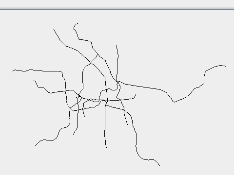
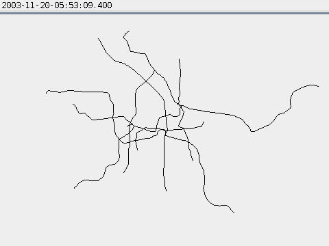
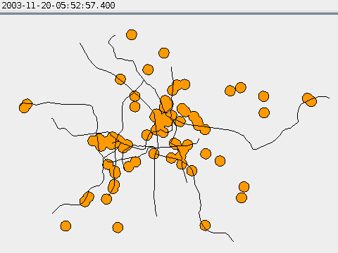

# Secondo in Docker

[Secondo](http://dna.fernuni-hagen.de/secondo) is an extensible database system which is designed at the FernUniversit&auml;t in Hagen. Secondo supports non-standard data types, like moving objects for spatio-temporal processing, and many more. Secondo is designed to be extensible with new algebras, which allows new data types and operations to be incorporated to it.

## Getting Started

### Installation

Clone this repository and type this command to build and run Secondo server.

```
docker-compose up -d --build
```

### GUI

Secondo provides a GUI application which precompiled binaries can be downloaded at [this link](http://dna.fernuni-hagen.de/secondo/content_down.html#gui). Secondo GUI automatically connects to `localhost:1234` (server) and `localhost:1235` (optimizer) at startup.

### Sample Database

**berlintest** database which is provided by Secondo itself must be imported first to the DBMS before trying query examples below this section, which can be done by following these steps.

1. Open `bash` shell inside Secondo server container.
   ```
   docker exec -it secondo-docker_kernel_1 bash
   ```

2. Type these commands on the `bash` shell which will open Secondo client-server shell.
   ```
   source .secondorc
   cd secondo/bin
   ./SecondoTTYCS
   ```

3. Type these commands on the Secondo shell to import **berlintest** database.
   ```
   restore database berlintest from './berlintest';
   q
   ```

The previous import steps can be tested by opening the **berlintest** database using command below in Secondo GUI.

```
open database berlintest
```

### Queries

Secondo supports two types of queries: SQL-like queries and Secondo application queries. SQL-like queries will be preprocessed by the optimizer and be converted to Secondo application queries which will be passed to the Secondo server to be further processing.

#### Trajectory of `Trains`' `Trip`



Get the trajectory line of the `Trains`' `Trip` using SQL-like query. Ensure that the optimizer is working before executing this query.

```
select trajectory(Trip) as TripLine from Trains
```

#### `Trains`' `Trip` Covered in Snow



Get part of `Trains`' `Trip` which has been covered in snow. A train has been covered in snow or not is known whether the train has passed the `msnow` area, which is a moving area represents snowing areas at time, or not.

```
query Trains
  feed
  extend[Trip1: intersection(.Trip, msnow)]
  filter[(no_components(.Trip1) > 0)]
  extend[Trip2:
    .Trip atperiods createPeriods(
      inst(initial(.Trip1)), maxInstant(), TRUE, TRUE)]
  project[Trip2] consume
```

#### `Trains`' `Trip` in Radius of Cinemas



Get part of `Trains`' `Trip` which is in specified radius of `Kinos` using two queries: find out the area around the cinema in the specified radius, then find out `Trains`' `Trip` inside the area from the previous query.

```
let KinosSightRegion = Kinos
  feed
  extend[SightRegion: circle(.GeoData, 500.0, 16)]
  aggregateB[
    SightRegion;
    fun(r1: region, r2: region) r1 union r2;
    [const region value ()]]
```

```
query Trains
  feed
  extend[SeeingKinos: (.Trip at KinosSightRegion)]
  project[SeeingKinos] consume
```

## Acknowledgments

- M. Akmal Pratama ([akmalpratama](https://github.com/akmalpratama)) as my teammate for Secondo exploration assignment.
- Dr. Fazat Nur Azizah ST, M.Sc. as the lecturer of **IF4040 Advanced Data Modeling** course who introduces concept of moving object and Secondo Database System to us.

## References

- [SECONDO - An Extensible Database System](http://dna.fernuni-hagen.de/secondo)
- [Secondo User Manual](http://dna.fernuni-hagen.de/secondo/files/Documentation/General/SecondoManual.pdf)
- [Short Guide to Using Secondo](http://dna.fernuni-hagen.de/secondo/files/Documentation/General/Secondo-mod.pdf)
